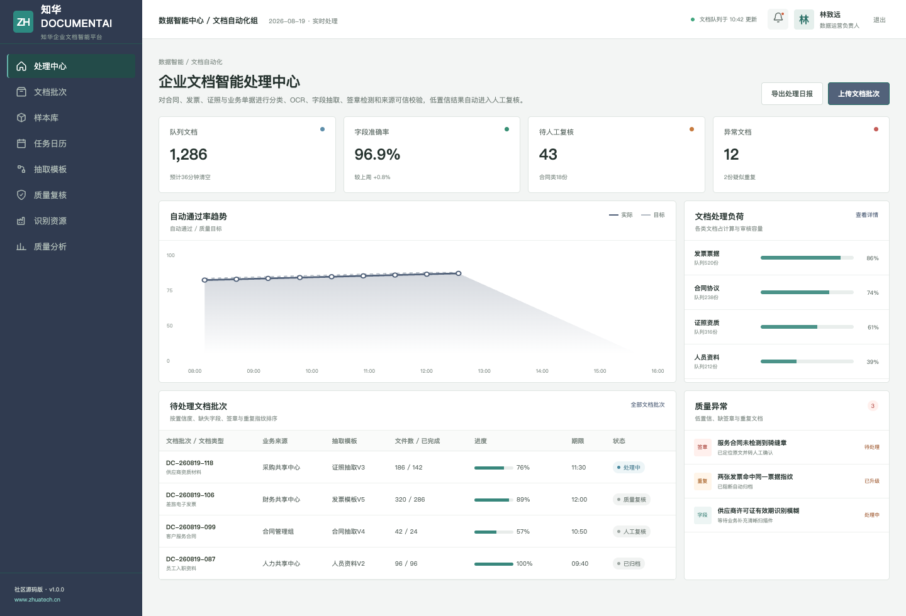
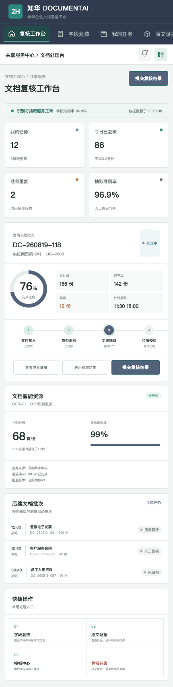

# 知华 DocumentAI 社区版

> 把合同、发票、证照和业务单据转换为可验证的结构化数据，而不是只有一个“看起来正确”的 OCR 结果。

出品方：[知华科技（上海如静知华信息科技有限公司）](https://www.zhuatech.cn/)　工程包名：`cn.zhuatech.documentai`

## 产品现场



平台提供文档分类、OCR、版式分析、字段抽取、签章检测、重复指纹、来源可信校验和人工复核。每个字段均可回到原文页码与位置；置信度不足、必填字段缺失或签章异常时，系统不会自动入库。

| 能力 | 说明 |
| --- | --- |
| 智能接入 | 支持合同、发票、证照、人员资料和自定义单据类型 |
| 可信抽取 | 综合 OCR、版式、来源和字段完整性计算置信度 |
| 质量闭环 | 人工修订、抽样复核、重复检测与准确率看板 |
| 安全设计 | 最小权限、脱敏样本、审计日志与人工最终确认 |



## 开发者快速开始

技术栈：Java 21 / Spring Boot / JWT / JPA / Flyway / MySQL 8；Vue 3 / Vite / Pinia。

```bash
docker compose up --build
```

访问 `http://localhost:5173`，演示账号为 `admin / Demo@2026` 或 `operator / Demo@2026`。文档可信抽取接口：`POST /api/ai/document/extract`。项目同时提供 H2 自动化测试、健康检查和容器化配置；参见 [接口文档](docs/api.md)与[架构说明](docs/architecture.md)。

## 授权声明

本工程仅能用于个人、非商业学习交流，**不得商用**。企业内部部署、生产使用、SaaS、客户交付、收费服务、品牌替换或商业发行，须取得上海如静知华信息科技有限公司书面授权，以 [LICENSE](LICENSE) 为准。

文档智能、OCR/大模型集成、私有化部署、软件项目外包和 FDE 服务，请访问[知华科技官网](https://www.zhuatech.cn/)或添加微信：

| 技术咨询 | 商业授权与定制 |
| --- | --- |
|  |  |

Copyright © 2026 上海如静知华信息科技有限公司
